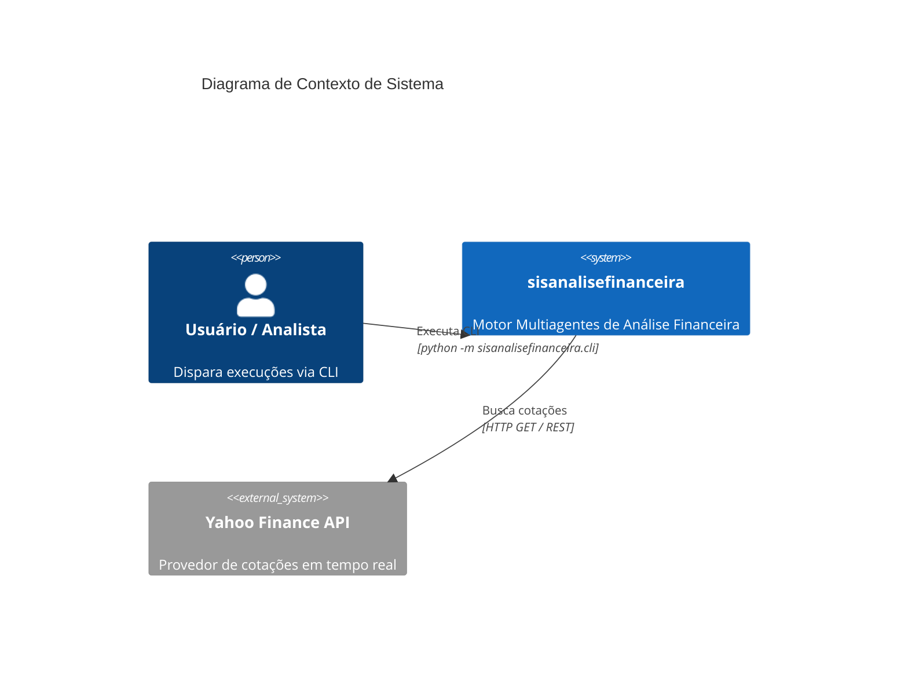

# Visão Geral da Arquitetura — sisanalisefinanceira

> **Status:** 🟢 CONFIRMADO  
> **Nível de Documentação:** Essencial  
> **Gerado por:** Arquiteto  

---

## 1. Introdução e Propósito Arquitetural

O **sisanalisefinanceira** é um sistema autônomo de análise financeira construído em Python 3.10+, estruturado com foco em **processamento determinístico e resiliência**. O objetivo da arquitetura é combinar a autonomia de agentes de IA com o rigor matemático de bibliotecas científicas (`Pandas`, `NumPy`, `SciPy`), garantindo que relatórios financeiros nunca contenham alucinações numéricas.

---

## 2. Diagrama de Contexto (C4 - Level 1)

---

## 3. Modelo de Entidades e Schemas Pydantic (ERD Resumido)

O modelo de dados do sistema baseia-se em 3 schemas Pydantic imutáveis:

```mermaid
erDiagram
    MarketDataPayload ||--o{ QuantAnalysisMetrics : "processado por"
    AgentState ||--|| MarketDataPayload : "contém"
    AgentState ||--|| QuantAnalysisMetrics : "contém"

    MarketDataPayload {
        string symbol PK
        list_float price_history
        list_float volume
        dict metadata
    }

    QuantAnalysisMetrics {
        string symbol PK
        list_float moving_average
        float volatility
        float mean_price
        float max_price
        float min_price
        float std_dev
        string error_code
        list_string warnings
    }

    AgentState {
        dict input_params
        int iteration_count
        string error_state
        string final_report
    }
```

---

## 4. Estilos Arquiteturais e Padrões de Projeto

1. **Adapter Pattern / Multi-Engine Orchestration:**
   - O sistema abstrai a orquestração permitindo uso intercambiável de `LangGraphOrchestrator` (orquestração por grafo de estados) e `CrewAIOrchestrator` (orquestração sequencial por tarefas).
2. **Strategy Pattern / Tool Calling:**
   - Os cálculos quantitativos utilizam ferramentas puras baseadas em `Pandas`/`NumPy` com fallback transparente para funções matemáticas nativas da linguagem em ambientes restritos.
3. **Anti-Hallucination Guardrail:**
   - Camada de validação pós-geração que verifica correspondência biunívoca entre os números do relatório Markdown e as métricas calculadas.

---

## 5. Dívidas Técnicas e Oportunidades Identificadas

- ⚠️ **Ausência de arquivo `requirements.txt` ou `pyproject.toml` no repositório:** Dependências listadas apenas no `README.md`.
- ⚠️ **Suíte de testes parcial:** Apenas os módulos `data_collector` e `quant_analyst` possuem testes unitários (`test_data_collector.py` e `test_quant_analyst.py`). O `report_writer` e os `orchestrators` carecem de cobertura automatizada.
- 💡 **Tratamento de Rate Limit:** A chamada HTTP para a Yahoo Finance não possui mecanismo de retry exponencial com decorrelativo jitter (apenas timeout de 5s e fallback imediato).
