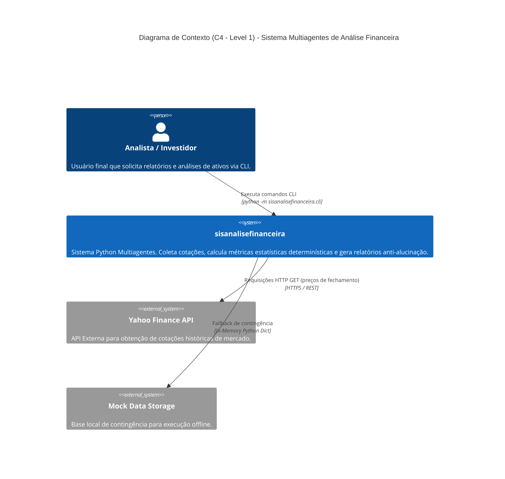

# C4 Model — Nível 1: Diagrama de Contexto — sisanalisefinanceira

> **Status:** 🟢 CONFIRMADO  
> **Gerado por:** Arquiteto  

```mermaid
C4Context
    title Diagrama de Contexto (C4 - Level 1) - Sistema Multiagentes de Análise Financeira

    Person(user, "Analista / Investidor", "Usuário final que solicita relatórios e análises de ativos via CLI.")
    
    System(system, "sisanalisefinanceira", "Sistema Python Multiagentes. Coleta cotações, calcula métricas estatísticas determinísticas e gera relatórios anti-alucinação.")

    System_Ext(yahoo, "Yahoo Finance API", "API Externa para obtenção de cotações históricas de mercado.")
    System_Ext(mock, "Mock Data Storage", "Base local de contingência para execução offline.")

    Rel(user, system, "Executa comandos CLI", "python -m sisanalisefinanceira.cli")
    Rel(system, yahoo, "Requisições HTTP GET (preços de fechamento)", "HTTPS / REST")
    Rel(system, mock, "Fallback de contingência", "In-Memory Python Dict")
```
