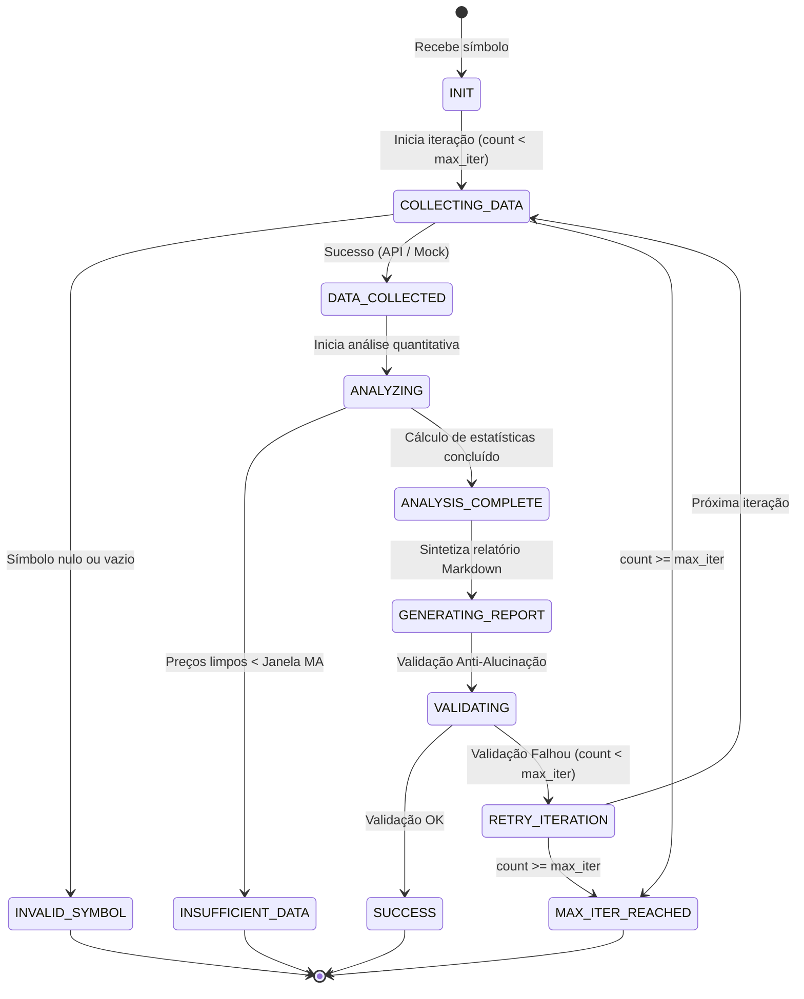

# Máquinas de Estado (State Machines) — sisanalisefinanceira

> **Status:** 🟢 CONFIRMADO  
> **Gerado por:** Detetive  

---

## 1. Máquina de Estados do Agente (`AgentState`)

A entidade central de estado da execução do pipeline multiagente é representada pela classe `AgentState`. 

---

## 2. Descrição das Transições e Gatilhos

| Estado de Origem | Estado de Destino | Condição / Gatilho | Ação Executada |
|---|---|---|---|
| `INIT` | `COLLECTING_DATA` | Chamada `run(symbol)` | Instancia `AgentState(iteration_count=0)` |
| `COLLECTING_DATA` | `INVALID_SYMBOL` | `symbol` em branco | Define `error_state = "INVALID_SYMBOL"` e aborta |
| `COLLECTING_DATA` | `DATA_COLLECTED` | Leitura da API Yahoo ou Mock local | Popula `state.raw_data = MarketDataPayload(...)` |
| `DATA_COLLECTED` | `INSUFFICIENT_DATA` | `len(prices) < window` | Define `error_state = "INSUFFICIENT_DATA_POINTS"` e aborta |
| `DATA_COLLECTED` | `ANALYSIS_COMPLETE` | Sucesso no cálculo | Popula `state.quant_analysis = QuantAnalysisMetrics(...)` |
| `ANALYSIS_COMPLETE` | `VALIDATING` | Geração do Markdown | Chama `writer.validate_anti_hallucination(...)` |
| `VALIDATING` | `SUCCESS` | Retorno `True` na validação | Atribui `state.final_report` e conclui |
| `VALIDATING` | `MAX_ITER_REACHED` | Retorno `False` e `iteration_count >= max_iter` | Define `error_state = "MAX_ITER_REACHED"` e encerra |
